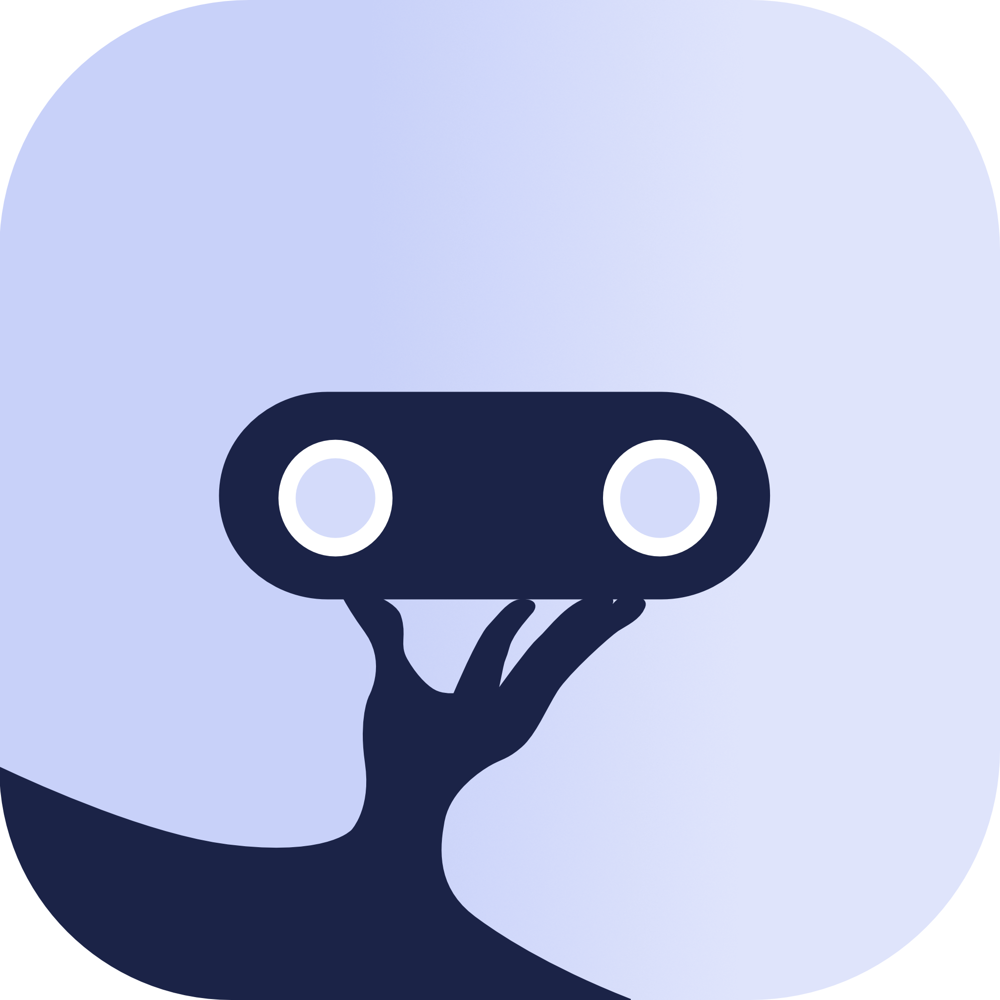

<p align="center">
    
</p>
<h1 align="center">WaiterRobot</h1>
<p align="center">Lightning fast and simple gastronomy</p>

# iOS

This Repository includes the iOS version of the WaiterRobot App. It is based on a shared Kotlin-Multiplatform (KMM)
module, which can be found [here](https://github.com/DatepollSystems/waiterrobot-mobile_android-shared) (there you can
also find the Android version of the app).
The KMM module is integrated as a Swift-Package (shared).

## Getting started

This project uses XcodeGen for generating the Xcode project.

1. If not installed, you can install XcodeGen using brew:

```bash
brew install xcodegen
```

2. Generate the Xcode project (run in root folder, where the `project.yml` lives):

```bash
xcodegen
```

This command must also be run after switching branches and it's advisable to also run it after a `git pull`

3. Open the `WaiterRobot.xcodeproj` in Xcode and start coding :)

> If the Build fails with an exception that the binaries for the shared library couldn't be downloaded, you need to add 
> the following to your `~/.netrc` file (create the file if it doesn't exist) to allow accessing the GitHub API.
> The personal access token can be created under [Settings -> Developer settings -> Personal access tokens -> Fine-grained tokens](https://github.com/settings/tokens?type=beta). "Public Repositories (read-only)" permission should be enougth.

```
machine maven.pkg.github.com
  login [github username]
  password [your new personal access token]
```

## Dev with local KMM module version

For a guide to use a local version of the KMM module
see [KMMBridge local dev spm](https://touchlab.github.io/KMMBridge/spm/IOS_LOCAL_DEV_SPM)

### Short version

1. Run `./gradlew spmDevBuild` in the KMM project (must be run after each change in the KMM module)
2. Drag the whole KMM project folder (top level git folder) into the WaiterRobot project in Xcode
3. Start programming :)
4. When finished delete folder, make sure to select "Remove References"!!! (otherwise the whole KMM
   project will be deleted locally)

## Releasing

Production release is triggered on push to main. The CI then builds the app and deploys it to
TestFlight. After testing the app then must be released manually from there. A tag in the form of 
`major.minor.patch` (e.g. android-1.0.0) is created. (see [publish.yml](.github/workflows/publish.yml))

> Do not forget to bump the iOS app version ([project.yml](project.yml), CFBundleShortVersionString & CFBundleVersion) 
> on the dev branch after a production release was made.

On each push to develop also a lava (dev) build is triggered and published to TestFlight of
the WaiterRobot Lava app. A tag in the form of `major.minor.patch-lava-epochMinutes` is created 
(e.g. android-1.0.1-lava-27935730). (see [publish.yml](.github/workflows/publish.yml))

# Language, libraries and tools

- [Swift](https://www.apple.com/de/swift/)
- [XcodeGen](https://yonaskolb.github.io/XcodeGen/)
- [SwiftUI](https://developer.apple.com/xcode/swiftui/)
- [CodeScanner](https://github.com/twostraws/CodeScanner) QR-Code scanner
- [UIPilot](https://canopas.github.io/UIPilot/) SwiftUI navigation
- [Fastlane](https://docs.fastlane.tools/)
  - [Match](https://docs.fastlane.tools/actions/match/)
